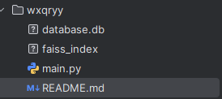

Your file structure in the project should be like this:

You can download additional files of databases there:
1. faiss_index: https://drive.google.com/file/d/1mUetoYGk3WaUapCj3jPRB16lNjtFGodq/view?usp=sharing
2. database.db: https://drive.google.com/file/d/17n0-esqrE9S3z0PWok46erVp7KO820ZL/view?usp=sharing

My telegram: t.me/wxqryy

There are about 130 000 movies in databases.

To run this rag you need 8gb of VRAM.
